# FRESH FACE

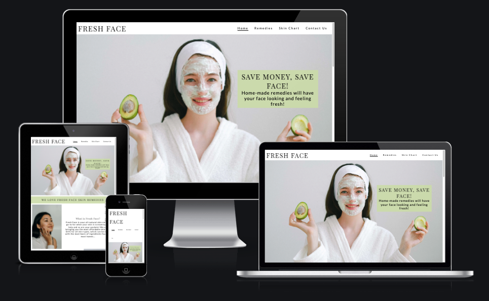

[View Fresh Face Live Website Here](https://aasanusi.github.io/fresh-face/)

## Overview
Fresh Face is a skin care site that was created to provide skin care solutions to people who are struggling with keeping their skin under control. This site provides natural remedies as well as a skin chart to help combat their facial issues and to stop them from wasting money on high-end skin care brands.

This site is targeted to individuals who are looking to improve their skin appearance and to have a better quality of life through having a fresher and healthier skin.

HTML5 and CSS3 are the only technologies used to create this static and responsive front-end site. This site is easy to navivigate and it's accesible to a broad range of devices.

## Contents
- [User Experience (UX)](#User-Experience-UX)
   - [User Stories](#User-Stories)
      - [First Time User](#First-Time-User)
      - [Revisiting User](#Revisiting-User)

- [Design](#Design)
   - [Colour Scheme](#Colour-Scheme)
   - [Typography](#Typography)
   - [Imagery](#Imagery)

- [Feature](#Features)
   - [Existing Features](#Existing-Features)
      - [Navigation Bar](#Navigation-Bar)
      - [We love Fresh Face Remedies Section](#We-love-Fresh-Face-Remedies-Section)
      - [Testimonials Section](#Testimonials-Section)
      - [The Footer](#The-Footer)
      - [Remedies Page](#Remedies-Page)
      - [Skin Chart Page](#Skin-Chart-Page)
      - [Contact Us Page](#Contact-Us-Page)
      - [Features Left To Implement](#Features-Left-To-Implement)

- [Technologies Used](#Technologies-Used)
   - [Languages Used](#Languages-Used)
   - [Frameworks, Libraries & Programs Used](#Frameworks,-Libraries-&-Programs-Used)
      - [Balsamiq](#Balsamiq)
      - [Google Fonts](#Google-Fonts)
      - [Font Awesome](#Font-Awesome)
      - [Git](#Git)   
      - [Gitpod](#Gitpod)
      - [Github](#Github)
      - [Gitpod Full Template](#Gitpod-Full-Template)

- [Testing](#Testing)
  - [Bugs Encountered & Solutions](#Bugs-Encountered-&-Solutions)
  - [Validator Testing](#Validator-Testing)
     - [HTML](#HTML)
     - [CSS](#CSS)
     - [Lighthouse](#Lighthouse)     
  - [Unfixed Bugs](#Unfixed-Bugs)

- [Deployment](#Deployment)

- [Credits](#Credits)
   - [Code](#Code)
   - [Content](#Content)
   - [Media](#Media)
   - [Acknowledgments](#Acknowledgments)
      - [Mentor](#Mentor)
      - [Tutor Support Team](#Tutor-Support-Team)
      - [Fellow classmates/alumnis on Slack](#Fellow-classmates/alumnis-on-Slack)

## User Experience (UX)
- ### User Stories
  - #### First Time User
    - As a first time user, I want to be sold on why to use Fresh Face remedies instead of buying branded skincare.
    - As a first time user, I want to find it easy to navigate the site.
    - As a first time user, I want to be able to use the site across different browsers and devices.
    - As a first time user, I want to able find skin care remedies for my skin type.
    - As a first time user, I don't know my skin type, therefore, I would like to be able to determine my skin type.
    - As a first time user, I want to be able to find your social media accounts.
  - #### Revisiting User
    - As a revisiting user, I want to be able to contact the organisation if I have any questions.
    - As a revisiting user, I want to be able to find monthly updates on the skin care remedy.

- ### Design
  - #### Colour Scheme
    - This site uses three colours that truly represents Fresh Face. The green pastil colour was chosen for all the headings and footer background colour as well as for the hover colour in the form section. The white colour was chosen as the main background colour for all the pages and to allow a good contrast for the texts and images. The grey colour was chosen as the colour for the form. All these colours complemented each other properly and creates a consistent colour flow across the website.
  - #### Typography
    - Playfair Display is the main font used for the headings across the page. This was chosen as it's a font that is well suited for titles and headings.
    - Lato is the main font used for the rest of the text across the page. This was chosen as it compliments the Playfair Display font, therefore, giving the website a nice flow.
    - Sans serif was chosen as the fallback font in case some browsers don't import the other fonts. Sans serif is the generic font used as a fallback font.
  - #### Imagery
    - The purpose of images on this website is to catch the attention of the user and to support the information provided on the website. All the images on this website were taken from [Pexels](https://www.pexels.com/) which is a free stock image website and they've been [credited](#Credits).

## Features 
The features on this website was created to aid users with finding information on how to combat their skin texture and appearance. This website consists of the Home page, Remedies page, Skin Chart page and Contact Us page.

### Existing Features 
- #### Navigation Bar
  - Consists of the logo of the website and the navigation links such as the Home page, Remedies page, Skin Chart page and the Contact Us page. They are all identical and consistent across all four pages.
  - This was created to aid the users to navigate each page with just one click. Logo was also created to be able to link back to the Home page when clicked on.

- #### Hero Image
  - This consists of the selling image and a catchphrase with a message overlay which outlines the advantages of the using natural remedies.
  - The image has a woman with a facial mask at the forefront to which will grab the users attention and help them understand what the website is about.

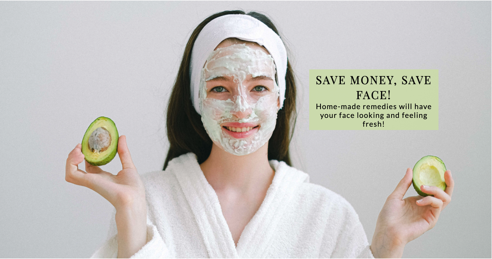

- #### We Love Fresh Face Remedies Section
  - This section provides information on what Fresh Face is and its purpose. This section is broken into two sections:
     - What is Fresh Face?
     - Why you need Fresh Face!
  - This section is intended to help the users to get a summary of the website and to keep them engaged long enough until they can commit to checking out the whole website.

**Image - What is Fresh Face?**

**Image - Why you need Fresh Face!**

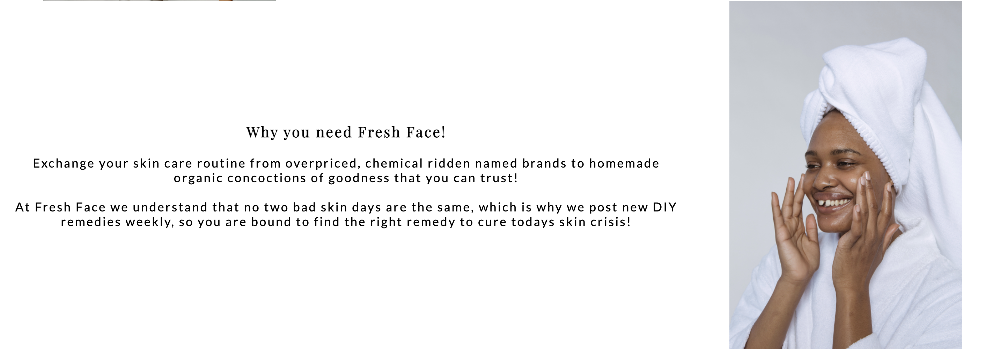

- #### Testimonials Section
  - This section consists of previous users describing how using Fresh Face remedies has helped them to fight their skin issues.
  - This section is intended to gain the trust of the user and to show that Fresh Face remedies work.

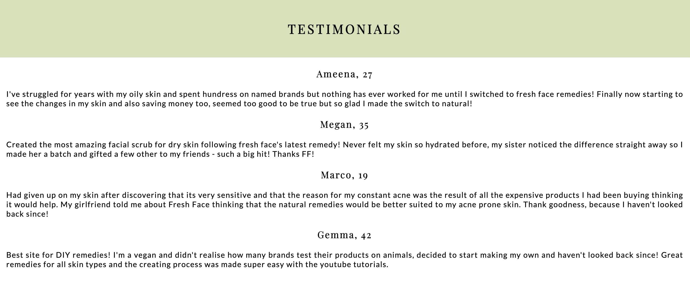

- #### The Footer
  - The footer section contains links to Fresh Face social media pages such as Facebook, Instagram, Twitter and Youtube. When clicked on, links will open in a new tab for the user to view.
  - The footer is essential to keep the users connected through the various social media outlets.
  - The footer also contains the copyright for the website and the company.

- #### Remedies Page
  - The remedies page provides the user with information on the different types of Fresh Face remedies for the following skin types: 
     - Dry
     - Oily
     - Combination
     - Acne Prone
  - This page provides the user a step by step guide on ingredients, how to make, how to apply and how it treats the skin.
  - This page is valuable to the user as they will be able to identify the relevant Fresh Face remedy that is best suited for their skin type

**Image - Dry Skin Remedy**

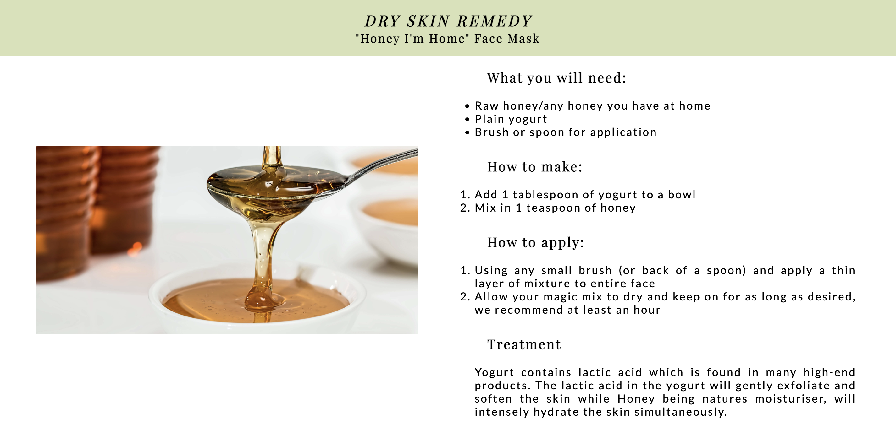

**Image - Oily Skin Remedy**

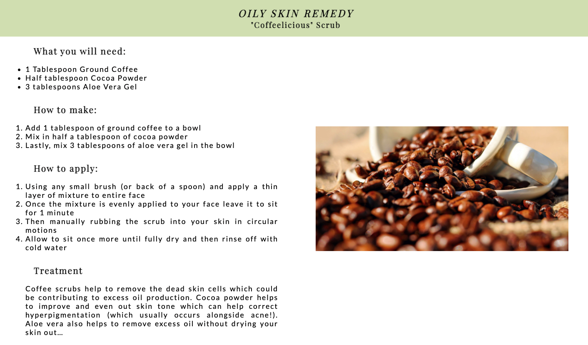

**Image - Combination Skin Remedy**

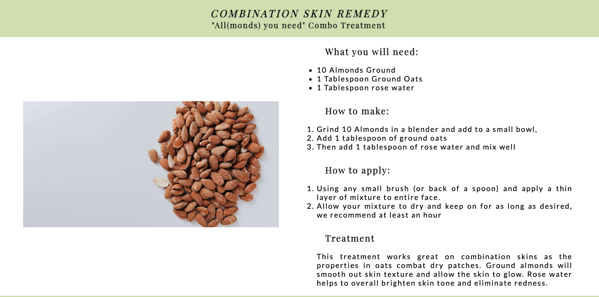

**Image - Acne Prone Skin Remedy**

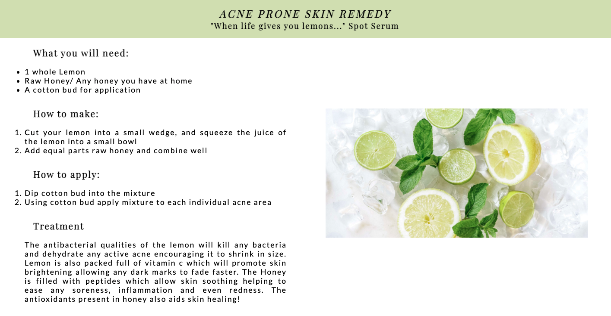

- #### Skin Chart Page
  - The skin chart page consists of information to determine their skin type.
  - It provides the skin types and the symptoms associated with it.
  - Determining their skin type will then help them choose the relevant Fresh Face remedy.

**Image - Dry and Oily Skin Chart**

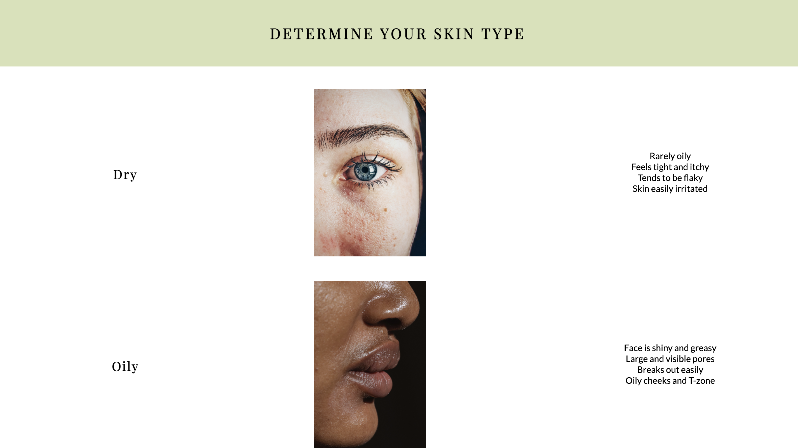

**Image - Combination and Acne Prone Skin Chart**

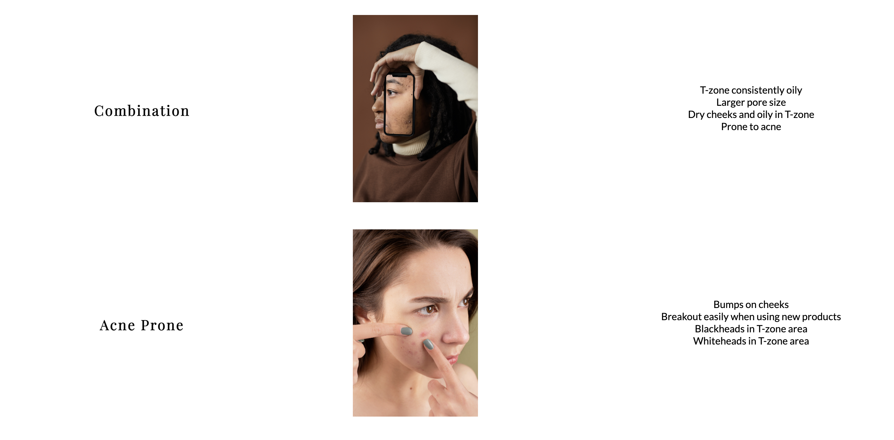

- #### Contact Us Page
  - This page will allow the user to provide feedbacks on Fresh Fresh remedy and ask us any specific questions about Fresh Face remedies. The user will need to give their full name and email address in order to submit their feedback.
  - This page also consists of Fresh Face contact details such as phone number, email address and location address. This is to encourage the users to reaching out to us for support.

**Image - Feedback Form**

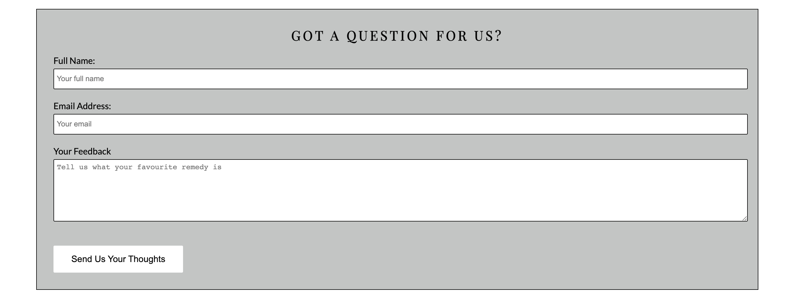

**Image - Contact Details**

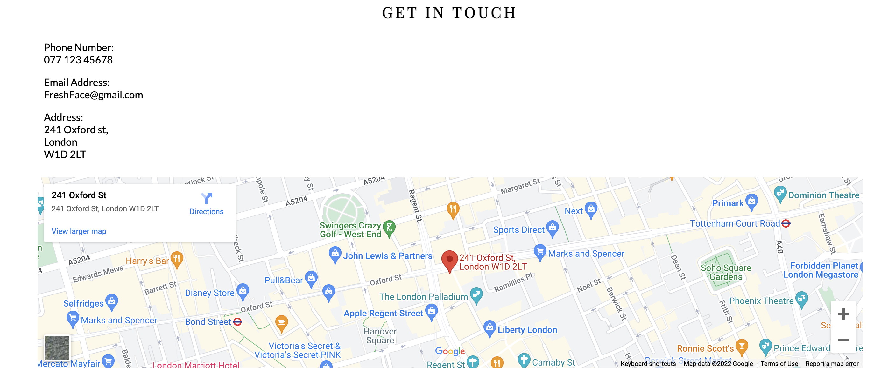

## Features Left To Implement
- Add dropdown menu and links to each remedy section when user clicks on remedies on the navigation bar.
- Develop the skin chart page into an advanced chart for users to visualize and determine thier skin type.
- Use JavaScript, to add a feature that links the skin chart page to the remedies page. To create a feature on the skin chart page to which after user determines their skin type they can click on it and it will automatically redirect them to the remedies page and to the specific remedy associated with that skin type.

## Technologies Used

### Languages Used

[HTML5](https://en.wikipedia.org/wiki/HTML5)
[CSS3](https://en.wikipedia.org/wiki/CSS)

### Frameworks, Libraries & Programs Used

1. #### [Balsamiq:](https://balsamiq.com/)
  - Balsamiq was used to create the basic frameworks of the project to which helped to coding the website.

2. #### [Google Fonts:](https://fonts.google.com/)
  - Google fonts was used to import "Playfair Display" and "Lato" fonts into CSS and used throughout the website.

3. #### [Font Awesome:](https://fontawesome.com/)
  - Font Awesome was used to create the social media icons in the footer to provide a visual link for the users to click and access the social media accounts. It was also used for the copyright icon.

4. #### [Git:](https://git-scm.com/)
  - Git was used in the Gitpod terminal to add, commit and push code to Github.

5. #### [Gitpod:](https://www.gitpod.io/)
  - Gitpod is the Integrated Developer Environment used to code this project.

6. #### [Github:](https://github.com/)
  - Github was used to hold and keep the pushed codes by Git and store projects.

7. #### [Gitpod Full Template:](https://github.com/Code-Institute-Org/gitpod-full-template)
  - Gitpod Full Template was provided by code institute and it consisted of all the relevant tools needed to code this website.

## Testing
The site consists of the Home page, Remedies page, Skin Chart page and Contact us page. All these pages have been put through validators to ensure that there are no errors in the code and it's up to the required standard.

Responsiveness of this website was tested using Google Developer Tools to observe how each page appeared and functioned on different screen sizes. Tested appearance and functionality on different browsers such as Google Chrome and Safari.

### Bugs Encountered & Solutions:
 - #### Bugs
   - Hero Text was aligning incorrectly to the Hero Image at different screen sizes.

 - #### Solution
   - Solved by using percentages instead of pixels.

 - #### Bugs
   - Image for the oily prone skin remedy section wasn't aligning properly beside the text and was compressing the text to the left side of the page.

 - #### Solution
   - Issue was due to an extra div around the image and was causing the syling not to be applied. Solved this issue by removing the outer div to which then allows styles to be applied.

 - #### Bugs
   - On the skin chart page, the images and right hand texts were being pushed out of the screen at smaller screen sizes.

 - #### Solution
   - Solved by removing grid-template column and padding from div and replacing with text-align.

### Validator Testing
 - HTML
   - No errors were returned when passing through the official [W3C validator](https://validator.w3.org/nu/)

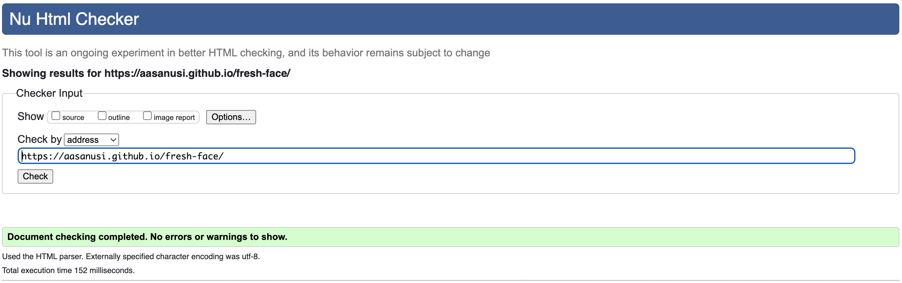

 - CSS
   - No errors were returned when passing through the official

 [(Jigsaw) validator](https://jigsaw.w3.org/css-validator/) 

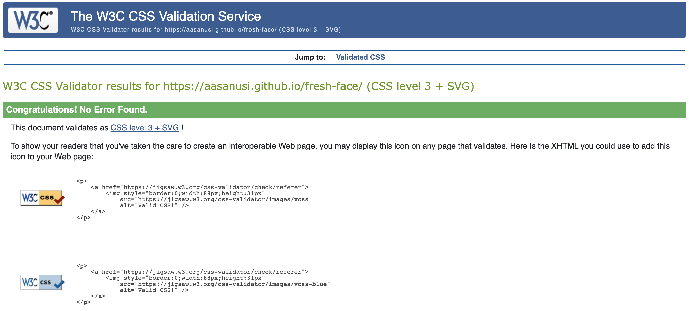

 - Lighthouse Testing
   - Performance score

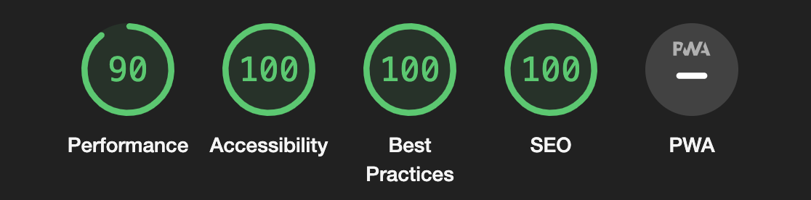

### Unfixed Bugs
All bugs were fixed before the submission of this project.

## Deployment
The open source developer environment used to write and edit code was Gitpod. Git was used to add, commit and push code to Github. Github is the hosting used to store pushed codes by Git.

- Below are the steps followed to deploy site to Github Pages:
  - Sign into Github (if not already signed in).
  - Access the relevant repository for the project that will be deployed.
  - At the top of project repository, click the settings tab to access more settings.
  - Sidebar appears on left-hand side, locate "Pages" tab at bottom of sidebar and click it.
  - Under Github Pages, locate "source" section and click on the branch dropdown labelled as none and change to "main"
  - Click "Save".
  - Give it a few minutes then refresh the page and a pop up box with live link to the project will appear.

The live link can be found [https://aasanusi.github.io/fresh-face/](https://aasanusi.github.io/fresh-face/).

## Credits
### Code
- [W3Schools:](https://www.w3schools.com/)
  - Aided in uderstanding on how to write certain codes.

- [Kinsta:](https://kinsta.com/blog/responsive-web-design/)
  - Kinsta website helped with forming media queries for the site.

### Content
- Content and codes were written by the developer.
- Love Running walkthrough video aided in forming the basic strutures of the website. Used README template to also form parts of this project's README.
- IDE and Deployment essential video was followed to help create README.
- [Steve Griffith Youtube Channel:](https://www.youtube.com/c/SteveGriffith-Prof3ssorSt3v3)
  - Helped with writing flexbox and grids.
- [Font Awesome:](https://fontawesome.com/)
  - Icons were imported from Font Awesome website.

### Media
All the photos used in this website was taken from a royalty and copyright free website called [Pexels](https://www.pexels.com/).

### Acknowledgments
- #### Mentor
  - I would like to thank my mentor for the initial help and tips to get started with my project such as advising me to use Balsamiq to form the basic parts of the website.
  - I woild like to thank my mentor for the continous feedback.

- #### Tutor Support Team
  - I would like to give a huge thanks to Christine for helping solve the aligning issues on the Remedies page.
  - I would like to thank Ger for educating me on some basic HTML and CSS.
  - I would like to thank Sean for helping solve the image issue on the Skin Chart page.

- #### Fellow classmates/aluminis on Slack
  - I would like to thank Jared for helping to solve the footer issue and providing me with README information.
  - I would like to thank Mat for providing resources to help build the website.
  - I would like to thank Lauren-Nicole for helping to solve the hero-image issue on the home page.
  - I would like to thank Bim for helping me understand some fundamental HTML and CSS and how to write media queries.

