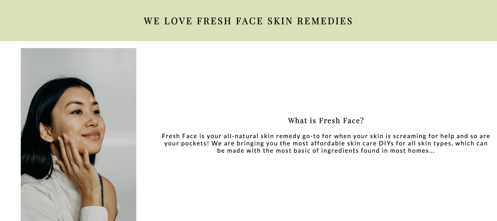

# Fresh Face

Live site can be viewed here! (Hyperlink text to live site link once created)

# Project Overview
Fresh Face is a skin care site that was created to help people who are struggling with keeping their skin under control. This site provides natural remedies as well as a skin chart to help combat their facial issues and to help them from overspending on high-end skin care brands. 

This site is targeted to individuals mainly women who are looking to improve their skin. This site will help people have control over their skin and also to determine what type of skin type they have to which they can take actions by using one of our recommended remedies.

HTML5 and CSS3 are the only technologies used to create this static and responsive front-end site. This site is accesible toa broad range of devices and quite simple navigaate for all users.

 
 

# Contents
<ul>
<li>
User Experience (UX)
<ul>
<li> User Stories
<ul>
<li>First Time User</li>
<li>Revisiting User
</ul>
</li>
</ul>
<ul>
<li>Design</li>
</ul>
</li>
</ul>
 
<ul>
<li>Features
<ul>
<li>Home</li>
<li>Remedies</li>
<li>Skin Chart</li>
<li>Contact Us</li>
</ul>
 
<ul>
<li>Existing Features
<ul>
<li>Navigation Bar</li>
<li>We love Fresh Face Remedies Section</li>
<li>Testimonials Section</li>
<li>The Footer</li>
<li>Remedies Page</li>
<li>Skin Chart Page</li>
<li>Contact Us Page</li>
</ul>
</li>
</ul>
</li>
</ul>

# User Experience (UX)
<ul>
<li> <strong>User Stories</strong>
<ul>
<li>First Time User
<ol>
<li>As a first time user, I want to be sold on why to use Fresh Face remedies instead of buying branded skincare.</li>
<li>As a first time user, I want to find it easy to navigate the site.</li>
<li>As a first time user, I want to able find skin care remedies for my skin type.</li>
<li>As a first time user that don't know their skin type, I want to be able to determine type of skin type I have.</li>
<li>As a first time user, I want to be able to find your social media accounts.</li>
</ol>
</li>
<li>Revisiting User
<ol>
<li>As a revisiting user, I want to be able to contact the organisation if I have any questions</li>
<li>As a revisiting user, I want to be able to find monthly updates on the skin care remedy</li>
</ol>
</ul>
</ul>

<ul>
<li><strong>Design</strong></li>
</ul>
 

# Features
The features on this website was created to aid users to be able to navigate the site and finding all the information they require to combat their skin. This website consists of the following 4 pages:
<ul>
<li><strong>Home</strong>
<ul>
<li>Fresh Face logo, navigation links, images and informational content about Fresh Face, testimonial and footer page</li>
</ul>
</li>
<li><strong>Remedies</strong>
<ul>
<li>Fresh Face logo, navigation links, skin care remedies for each skin type and footer page</li>
</ul>
</li>
<li><strong>Skin Chart</strong>
<ul>
<li>Fresh Face logo, navigation links, skin chart to find out skin type and footer page</li>
</ul>
</li>
<li><strong>Contact Us</strong>
<ul>
<li>Fresh Face logo, navigation links, contact form for questions/feedbacks, contact address and footer page</li>
</ul>
</li>
</ul>

## Existing Features 
<ul>
<li> <strong>Navigation Bar</strong>
<ul>
 
<li>Consists of the logo of the website and the navigation links such as the Home page, Remedies page, Skin Chart page and COntact Us page. They are all present, identical and consistent across all four pages.</li>
<li>This was created to aid the users to navigate each page by being able to hop from one page to another with ease. Logo was also created to be able to link back to the Home page when clicked on.</li>
</ul>
</li>
</ul>
 

 
 
<ul>
<li><strong>Hero Image</strong>
<ul>
<li>This consists of the selling image and a catchphrase with a message overlay which outlines the advantages of the company. </li>
<li>The image has an animation on it that zooms forward to which draws the user to what Fresh Face is about.</li>
</ul>
</li>
</ul>

<ul>
 
<li><strong>We Love Fresh Face Remedies Section</strong>
<ul>
<li>This section provides information on what Fresh Face is and its purpose. This section is broken into two sections:
<ul>
<li><strong>What is Fresh Face?</strong></li>
<li><strong>Why you need Fresh Face!</strong></li>
</ul>
</li>
 
<li>The information about Fresh Face is intended to help user understand the website and to commit them to keep scrolling the page as it also provides them with information as to why it's important to use our remedies.</li>
<li>This is intended to encourage users from using our recommended remedies. </li>
</ul>
</li>
</ul>
<strong>Image - What is Fresh Face?</strong>

<strong>Image - Why you need Fresh Face! </strong>

<ul>
<li>Testimonials Section
<ul>
<li></li>
<li></li>
</ul>
</li>
</ul>

<ul>
<li>The Footer
<ul>
<li></li>
<li></li>
</ul>
</li>
</ul>

<ul>
<li>Remedies Page
<ul>
<li></li>
<li></li>
</ul>
</li>
</ul>

<ul>
<li>Skin Chart Page
<ul>
<li></li>
<li></li>
</ul>
</li>
</ul>

<ul>
<li>Contact Us Page
<ul>
<li></li>
<li></li>
</ul>
</li>
</ul>

Features left to implement
 

# Technologies Used

<strong>Languages Used</strong>
<ul>
<li><a href="https://en.wikipedia.org/wiki/HTML5">HTML5</a></li>
<li><a href="https://en.wikipedia.org/wiki/CSS">CSS3</a></li>
</ul>

<strong>Frameworks, Libraries & Programs Used</strong>
<ol>
<li><a href="https://balsamiq.com/">Balsamiq:</a>
<ul>
<li>Balsamiq was used to create the basic frameworks of the project to which helped to coding the website</li>
</ul>
</li>
<li><a href="https://fonts.google.com/">Google Fonts:</a>
<ul>
<li>Google fonts was used to import "Playfair Display" and "Lato" fonts into styles.css and this was used throughout the website</li>
</ul>
</li>
<li><a href="https://fontawesome.com/">Font Awesome:</a>
<ul>
<li>Font Awesome was mainly used to create the social media icons in the footer to provide a visual link for the users to click and access the social media accounts. It was also used for the copyright icon.</li>
</ul>
</li>
<li>Git
<ul>
<li>Git was used in the Gitpod terminal to add, commit and push code to Github</li>
</ul>
</li>
<li>Gitpod
<ul>
<li>Gitpod was the open-source developer platform that was used to write code</li>
</ul>
</li>
<li><a href="https://github.com/">Github:</a>
<ul>
<li>Github was used to hold and keep the pushed codes by Git and store projects</li>
</ul>
</li>
<li><a href="https://github.com/Code-Institute-Org/gitpod-full-template">Gitpod Full Template:</a>
<ul>
<li>Gitpod Full Template provided by code institute to which has all the tools to aid us with our coding</li>
</ul>
</li>
</ol>
 

# Testing

## Validator Testing

## Unfixed Bugs

# Deployment

# Credit

## Content

## Media

# Other General Project Advice

